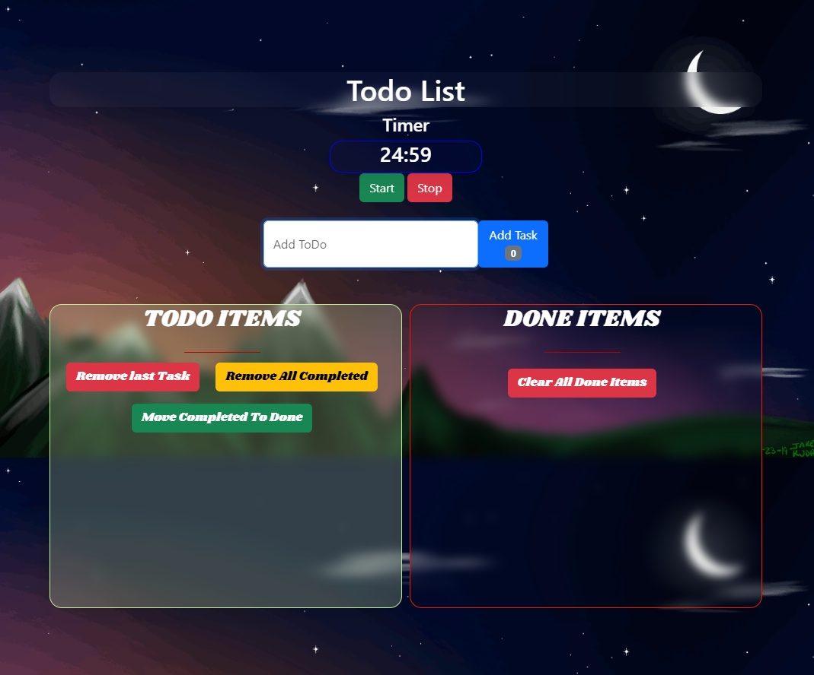

# Weather Application

## Overview

This Weather Application provides real-time weather updates and displays a map with the current weather conditions using the OpenWeatherMap API and OpenLayers. The app is built with HTML, CSS, and JavaScript, offering a user-friendly and interactive experience.


## Features

- **Real-Time Weather Updates**: Get current weather information for any location.
- **OpenLayers Map Integration**: View the selected location on an interactive map.
- **Responsive Design**: Accessible and user-friendly on all devices.

## Technologies Used

- **HTML**: For the structure of the application.
- **CSS**: For styling the application.
- **JavaScript**: For the functionality and interactivity of the application.
- **OpenWeatherMap API**: For fetching real-time weather data.
- **OpenLayers**: For displaying the map with weather conditions.

## Installation

1. Clone the repository:
   ```bash
   git clone https://github.com/AchmetCh/WeatherApp.git
   ```
2. Navigate to the project directory:
```bash
cd weather-app
```
3. Open index.html in your web browser to run the application.

## Usage
- Fetching Weather Data: Enter a city name or use the geolocation feature to get the current weather data.
- Viewing Weather Information: The app will display temperature, humidity, wind speed, and other weather details.
- Map Integration: View the location on an interactive map with OpenLayers.

## API Setup
Sign up at OpenWeatherMap to get your API key.
Replace the placeholder in the JavaScript file with your OpenWeatherMap API key:

## Contributing
Contributions are welcome! If you have any suggestions, bug reports, or improvements, feel free to fork the repository and submit a pull request.

## License
This project is licensed under the MIT License. You are free to use, modify, and distribute this software as you see fit.

Everyone is encouraged to fork this project and make it even better!

## Contact
If you have any questions or feedback, please contact me at gigsakos@gmail.com

Thank you for using the Weather Application! Stay updated with the latest weather conditions!